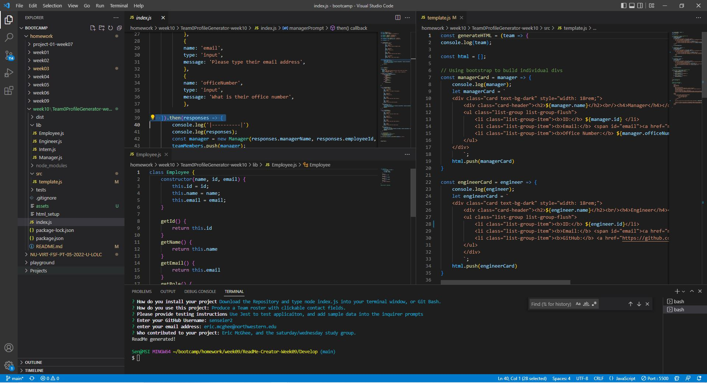

    
    

# Project Title: Team Profile Generator - week 10

## Description
    Team Profile Generator is an application that will produce a team roster with clickable email address fields.

- - - - -

## Table of Contents

* [Installation](#installation)
* [Usage](#usage)
* [License](#license)
* [Contributors](#contributors)
* [Test](#test)
* [Questions](#questions)

## Description
    Team Profile Generator is an application that will produce a team roster with clickable email address fields.  The application can be used to either track or document a teams membership and contact informaiton.  The employee types provided are Managers, Engineers, and Interns.

    You can also list their name, id's, and email as well as the engineers github username, and the interns school.

    The Team Profile generator will produce an HTML page with the referenced information.

Here is a link to the video: 
https://drive.google.com/file/d/1YXpPRIFzH3QvcvTTFsCbLYzXhkRk3lHB/view

And to see this project on github click here:
https://github.com/senseier2/Team0ProfileGenerator-week10

## User Story
    AS A manager
    I WANT to generate a webpage that displays my team's basic info
    SO THAT I have quick access to their emails and GitHub profiles

    GIVEN a command-line application that accepts user input

    WHEN I am prompted for my team members and their information

    THEN an HTML file is generated that displays a nicely formatted team roster based on user input

    WHEN I click on an email address in the HTML

    THEN my default email program opens and populates the TO field of the email with the address

    WHEN I click on the GitHub username

    THEN that GitHub profile opens in a new tab

    WHEN I start the application

    THEN I am prompted to enter the team manager’s name, employee ID, email address, and office number

    WHEN I enter the team manager’s name, employee ID, email address, and office number

    THEN I am presented with a menu with the option to add an engineer or an intern or to finish building my team

    WHEN I select the engineer option

    THEN I am prompted to enter the engineer’s name, ID, email, and GitHub username, and I am taken back to the menu

    WHEN I select the intern option

    THEN I am prompted to enter the intern’s name, ID, email, and school, and I am taken back to the menu

    WHEN I decide to finish building my team

    THEN I exit the application, and the HTML is generated

## Installation
    Download the Repository and type node index.js into your terminal window, or Git Bash.

## Usage
    Produce a Team roster with clickable contact fields.  Output will appear in the "dist/output" folder following the completed inquirer prompts.  You will find your new webpage with the added team members named "team.html".
    

## License
    This application is  covered under the [MIT] license.

## Contributors
    Eric McGhee, and the saturday/wednesday study group.

## Test Instructions
    Use Jest to test applicaiton, and add sample data into the inquirer prompts for testing data entries.  Saved tests are located in the "tests" folder.

## Questions

Please feel free to send questions via my GitHub profile: [senseier2](https://github.com/senseier2)
Or email me via: eric.mcghee@northwestern.edu

Readme created using week 09 readme generator.
    